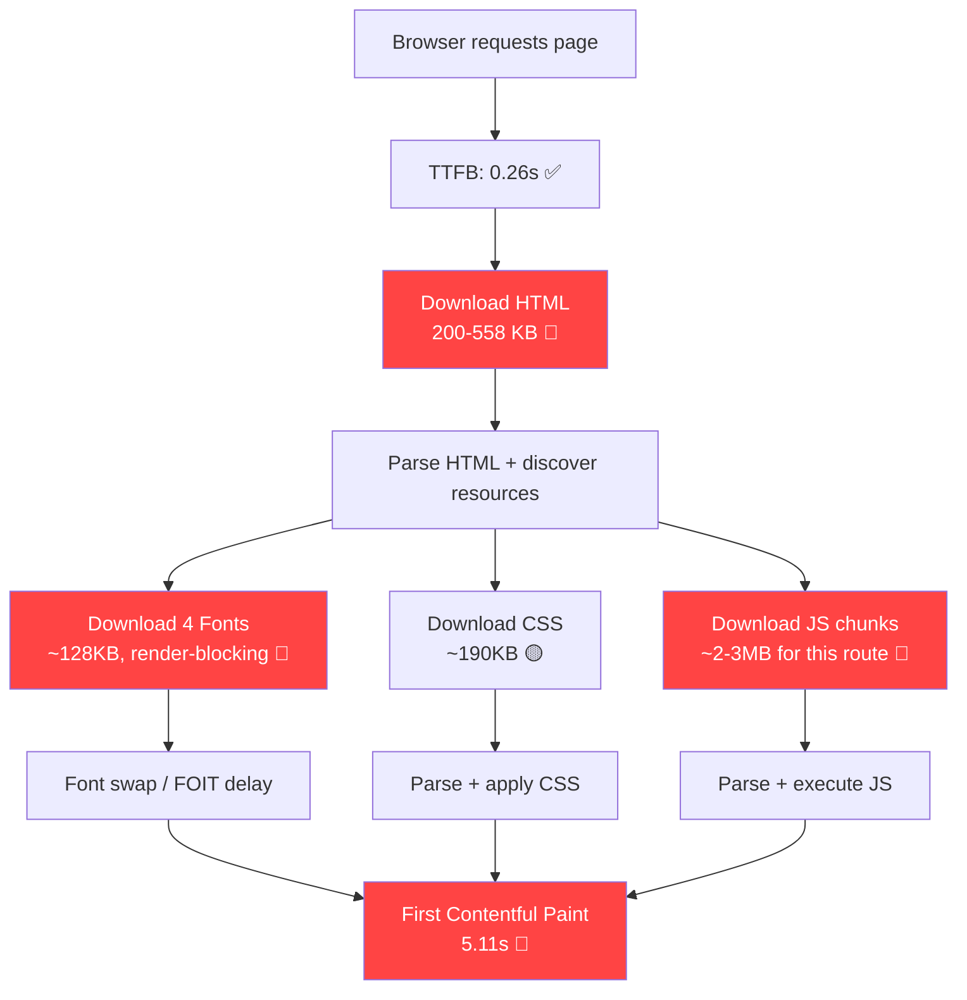

# Performance Deep-Dive: `/docs/components/[slug]`

> [!CAUTION]
> **FCP: 5.11s | LCP: 5.11s** — Both metrics are in the **"Poor"** range (>3s). The page is effectively broken from a Core Web Vitals perspective. FCP = LCP means the *entire visible content* is blocked until the very first paint.

---

## Executive Summary

The 5.11s FCP/LCP is caused by a **cascading chain of blocking resources** that the browser must download and process sequentially before painting *anything*. The single biggest culprit is **inlining massive Shiki-highlighted source code (up to 352KB) directly into the RSC payload**, but there are 7 other compounding issues.



---

## Root Cause Analysis

### 🔴 Issue #1: Massive Shiki Source Code Inlined in HTML (THE BIGGEST PROBLEM)

**Impact: ~40-50% of total FCP delay**

The `sourceCodeContent` prop in [DocsPageLayout](file:///Users/harshjadhav/Documents/Code/products/componentry/apps/web/components/docs-page-layout.tsx#64-374) pre-highlights the *entire component source code* with Shiki and inlines it into the server-rendered HTML/RSC payload. This highlighted HTML is enormous because Shiki wraps every token in styled `<span>` elements.

| Page | HTML Size | Source Code Highlight Size | % of Page |
|------|-----------|---------------------------|-----------|
| `flight-status-card` | 558 KB | **352 KB** | 63% |
| `circuit-board` | 506 KB | ~330 KB | 65% |
| `mac-keyboard` | 416 KB | ~270 KB | 65% |
| `hyper-text` | 117 KB | ~60 KB | 51% |

**Where this happens:**

In [docs-page-layout.tsx](file:///Users/harshjadhav/Documents/Code/products/componentry/apps/web/components/docs-page-layout.tsx#L354-L362):

```tsx
sourceCodeContent={
  installSourceCode ? (
    <Suspense fallback={<CodeBlockSkeleton />}>
      <CodeBlock
        code={installSourceCode}    // ← Full source code string
        lang="tsx"
        className="..."
      />
    </Suspense>
  ) : null
}
```

The [CodeBlock](file:///Users/harshjadhav/Documents/Code/products/componentry/apps/web/components/code-block.tsx#13-92) is a **server component** that calls [highlightCode()](file:///Users/harshjadhav/Documents/Code/products/componentry/apps/web/lib/shiki.ts#37-84), which runs Shiki on the full source. The resulting highlighted HTML (352KB for flight-status-card!) is serialized into the RSC payload which is inlined as `<script>` tags in the HTML document.

**Additionally**, the raw source code string is *also* serialized into the payload (for the copy button), so the source code exists **twice** in the HTML — once raw (~21KB) and once highlighted (~352KB).

> [!IMPORTANT]
> This is the #1 fix. The source code drawer is *hidden by default* and only shown when the user clicks the `<CodeXml>` button. There is zero reason to SSR 352KB of highlighted code that 95%+ of users never see.

**Fix:**
```tsx
// Instead of SSR-ing the source code highlight, load it on demand
// 1. Remove sourceCodeContent from server render
// 2. Create a client component that fetches highlighting via API route on click
// 3. Or use a lightweight client-side highlighter (e.g., shiki/wasm lazy-loaded)
```

---

### 🔴 Issue #2: 4 Render-Blocking Google Fonts

**Impact: ~15-20% of total FCP delay**

The root layout loads **4 separate Google Fonts** via `next/font/google`:

| Font | Weight(s) | Size |
|------|-----------|------|
| Plus Jakarta Sans | Full variable | ~36 KB |
| JetBrains Mono | Full variable | ~40 KB |
| Instrument Serif | 400 | ~16 KB |
| Syne | Full variable | ~28 KB |

From [layout.tsx](file:///Users/harshjadhav/Documents/Code/products/componentry/apps/web/app/layout.tsx#L11-L30):

```tsx
const fontSans = Plus_Jakarta_Sans({ subsets: ["latin"], variable: "--font-sans" })
const fontMono = JetBrains_Mono({ subsets: ["latin"], variable: "--font-mono" })
const fontSerif = Instrument_Serif({ subsets: ["latin"], weight: "400", variable: "--font-serif" })
const fontDisplay = Syne({ subsets: ["latin"], variable: "--font-display" })
```

Next.js preloads all 4 as `<link rel="preload">`, but the browser still needs to download ~120KB of font files before text can render (or wait for FOIT timeout).

**Key question:** Are all 4 fonts actually used on docs pages?
- `--font-sans` ✅ (body text)
- `--font-mono` ✅ (code blocks)
- `--font-serif` ❓ (likely only used on landing page)
- `--font-display` ❓ (likely only used on landing page — Syne is a display font)

**Fix:**
1. Move `Instrument_Serif` and `Syne` to only load on routes that use them (landing page layout)
2. Add `display: "swap"` to all font declarations to prevent FOIT
3. Consider `font-display: optional` for non-critical fonts to eliminate flash entirely
4. Subset fonts to only include characters actually used

---

### 🔴 Issue #3: Heavy Client-Side JavaScript Bundle

**Impact: ~20-25% of total FCP delay**

The docs component pages load substantial client-side JavaScript:

| Library | Approx. Bundle Size (uncompressed) | Used Where |
|---------|-----------------------------------|-----------|
| `framer-motion` | ~150-200 KB | DocsPreviewWrapper, FloatingDocsSidebar, CommandMenu |
| `cmdk` | ~30 KB | CommandMenu |
| `@fortawesome/react-fontawesome` + icons | ~50 KB | CommandMenu (2 icons!), SiteHeader |
| `react-dom` (createPortal usage) | Already included | DocsPreviewWrapper, CommandMenu |
| `next-themes` | ~5 KB | ThemeToggle |
| `zustand` | ~5 KB | useDocStore |

**Critical finding:** The [CommandMenu](file:///Users/harshjadhav/Documents/Code/products/componentry/apps/web/components/command-menu.tsx#213-399) component is loaded on *every* docs page (it's in the DocsPreviewWrapper toolbar), bringing in `cmdk`, `@fortawesome`, and `framer-motion` — all for a search dialog that most users never open.

From [docs-preview-wrapper.tsx](file:///Users/harshjadhav/Documents/Code/products/componentry/apps/web/components/docs-preview-wrapper.tsx#L8):
```tsx
import { CommandMenu } from "@/components/command-menu"  // ← Pulls in cmdk, @fortawesome, framer-motion
```

**Fix:**
1. **Lazy-load CommandMenu** — It's behind a button click, use `React.lazy()` + `Suspense`
2. **Replace @fortawesome with inline SVGs** — You're using only 2 icons (GitHub, X/Twitter). The FontAwesome React package is ~50KB for 2 SVG paths
3. **Replace framer-motion with CSS animations** where possible in the toolbar/wrapper
4. **Dynamic import for FloatingDocsSidebar** — Only loads when user hovers the sidebar trigger

---

### 🟡 Issue #4: Duplicate Inline `<style>` Tags

**Impact: ~2-3% page weight, contributes to parse time**

The same CSS rules are duplicated across components via inline `<style>` tags:

```tsx
// In CodeBlock (server component):
<style>{`
  .shiki { counter-reset: line; }
  .shiki code { display: grid; }
  .shiki [data-line]::before { ... }
  ...
`}</style>

// In DynamicCodeBlock (client component):
<style>{`
  .shiki { counter-reset: line; }
  .shiki code { display: grid; }
  ...
`}</style>

// In InstallCommand (client component):
<style>{`
  .no-scrollbar::-webkit-scrollbar { display: none; }
  ...
`}</style>
```

Each docs page has **3 duplicate `<style>` blocks** embedded in the HTML. These styles should be in the global CSS file.

**Fix:** Move all Shiki/scrollbar styles to [globals.css](file:///Users/harshjadhav/Documents/Code/products/componentry/packages/ui/src/styles/globals.css) and remove inline `<style>` tags.

---

### 🟡 Issue #5: Source Code Read via Dynamic Import (JSON Files)

**Impact: Slows build time, increases HTML payload**

From [source-code.ts](file:///Users/harshjadhav/Documents/Code/products/componentry/apps/web/lib/source-code.ts#L22):

```tsx
const registry = await import(`@/public/r/${componentName}.json`)
```

The raw source code string (e.g., 21KB for flight-status-card) is loaded at build time and serialized into the RSC payload **as-is**. Combined with Issue #1, this means each page carries the source code *twice*: raw + highlighted.

**Fix:** Don't embed source code in the initial HTML at all. Load it on demand when the user clicks "View Source".

---

### 🟡 Issue #6: Usage Code Highlighting at Build Time (Multiple Variants)

**Impact: 5-15KB extra per variant in HTML**

From [docs-page-layout.tsx](file:///Users/harshjadhav/Documents/Code/products/componentry/apps/web/components/docs-page-layout.tsx#L85-L98):

```tsx
let usageHtml = ""
if (typeof usageCode === "string") {
  usageHtml = await highlightCode(usageCode.trim(), "tsx" as BundledLanguage)
}

const variantHtmls = await Promise.all(
  examples.map(async (ex) => {
    return await highlightCode((ex.code || "").trim(), "tsx" as BundledLanguage)
  })
)
```

ALL variant code blocks are pre-highlighted and embedded in the HTML, even though the user only sees one at a time. For a component with 3 variants, that's 4x the highlighted code in the payload.

**Fix:** Only highlight the default variant at build time. Highlight other variants on-demand via client-side Shiki (lazy-loaded) or an API route.

---

### 🟡 Issue #7: CSS Bundle Size (190KB)

**Impact: ~5% of FCP delay**

The global CSS file is 190KB. This is the single CSS file for the entire site.

From [globals.css](file:///Users/harshjadhav/Documents/Code/products/componentry/packages/ui/src/styles/globals.css):
```css
@source "../../../apps/**/*.{ts,tsx}";
@source "../../../components/**/*.{ts,tsx}";
@source "../**/*.{ts,tsx}";
```

The `@source` directives scan the *entire* monorepo, generating utility classes for every component. Since all components share one CSS bundle, even landing-page-only styles are loaded on docs pages.

**Fix:**
1. Review if the `@source` paths are too broad
2. Consider route-based CSS splitting (Next.js 16 supports this)
3. Audit for unused animation keyframes and utility classes

---

### 🟢 Issue #8: Third-Party Scripts

**Impact: Minor, but compounds with everything else**

```tsx
// Root layout:
<Analytics />       // @vercel/analytics
<SpeedInsights />   // @vercel/speed-insights
```

These are loaded `afterInteractive` so they don't directly block FCP, but they compete for bandwidth and CPU after hydration.

**Fix:** These are fine, but ensure they don't interfere with hydration.

---

## Prioritized Fix Plan

| Priority | Fix | Estimated FCP Improvement | Effort |
|----------|-----|--------------------------|--------|
| **P0** | Lazy-load source code highlighting (don't SSR the "View Source" drawer content) | **-1.5 to 2.5s** | Medium |
| **P0** | Remove 2 unused fonts from docs layout (Instrument Serif, Syne) | **-0.5 to 1.0s** | Easy |
| **P1** | Lazy-load CommandMenu with `React.lazy` | **-0.3 to 0.5s** | Easy |
| **P1** | Replace @fortawesome with inline SVGs (2 icons) | **-0.2 to 0.3s** | Easy |
| **P1** | Only pre-highlight default variant code; lazy-highlight others | **-0.2 to 0.5s** | Medium |
| **P2** | Move Shiki CSS to globals.css (remove 3x inline `<style>` tags) | **-0.1s** | Easy |
| **P2** | Lazy-load FloatingDocsSidebar | **-0.1 to 0.2s** | Easy |
| **P2** | Add `display: "swap"` to all font declarations | **-0.1 to 0.3s** | Easy |
| **P3** | Audit CSS bundle for unused styles | **-0.1s** | Medium |
| **P3** | Consider replacing framer-motion in toolbar with CSS transitions | **-0.1 to 0.2s** | Hard |

**Estimated total improvement: 3.2 to 5.5s → target FCP of ~1.0 to 1.9s**

---

## Detailed Implementation Guide

### Fix 1: Lazy-Load Source Code (P0) — Biggest Win

**Current flow:**
```
Build time → readComponentSource() → highlightCode(352KB source) → serialize into RSC → inline in HTML
```

**Target flow:**
```
Build time → nothing for source code
User clicks "View Source" → fetch /api/highlight → stream highlighted HTML
```

**Step-by-step:**

1. **Create an API route** at `app/api/highlight/route.ts`:

```tsx
import { highlightCode } from "@/lib/shiki"
import { NextRequest, NextResponse } from "next/server"

export async function POST(req: NextRequest) {
  const { code, lang = "tsx" } = await req.json()
  const html = await highlightCode(code, lang)
  return NextResponse.json({ html })
}
```

2. **Modify [DocsPreviewWrapper](file:///Users/harshjadhav/Documents/Code/products/componentry/apps/web/components/docs-preview-wrapper.tsx#30-464)** to lazy-load source code:

```tsx
// Instead of receiving pre-rendered sourceCodeContent, receive raw source code
// and highlight it on-demand when user clicks "View Source"

const [sourceHtml, setSourceHtml] = useState<string | null>(null)
const [isLoadingSource, setIsLoadingSource] = useState(false)

const handleViewSource = async () => {
  setShowSource(true)
  if (!sourceHtml && sourceCode) {
    setIsLoadingSource(true)
    const res = await fetch("/api/highlight", {
      method: "POST",
      body: JSON.stringify({ code: sourceCode }),
    })
    const { html } = await res.json()
    setSourceHtml(html)
    setIsLoadingSource(false)
  }
}
```

3. **Remove `sourceCodeContent` prop** from [DocsPageLayout](file:///Users/harshjadhav/Documents/Code/products/componentry/apps/web/components/docs-page-layout.tsx#64-374). Only pass `sourceCode` (raw string) and `sourceCodeFilename`. The wrapper handles highlighting on click.

4. **Remove the [readComponentSource()](file:///Users/harshjadhav/Documents/Code/products/componentry/apps/web/lib/source-code.ts#4-45) call** from individual docs components if source code is no longer needed at build time. Instead, pass the registry path and let the client fetch it.

### Fix 2: Remove Unused Fonts from Docs (P0)

In [app/docs/layout.tsx](file:///Users/harshjadhav/Documents/Code/products/componentry/apps/web/app/docs/layout.tsx) or by creating a separate font configuration:

```tsx
// Option A: Create a docs-specific layout that only loads needed fonts
// app/docs/layout.tsx
import { Plus_Jakarta_Sans, JetBrains_Mono } from "next/font/google"

const fontSans = Plus_Jakarta_Sans({
  subsets: ["latin"],
  variable: "--font-sans",
  display: "swap",  // ← Add this
})

const fontMono = JetBrains_Mono({
  subsets: ["latin"],
  variable: "--font-mono",
  display: "swap",  // ← Add this
})

// Option B: Move Instrument_Serif and Syne to only load in the landing page layout
```

### Fix 3: Lazy-Load CommandMenu (P1)

```tsx
// In docs-preview-wrapper.tsx
import { lazy, Suspense } from "react"

const CommandMenu = lazy(() =>
  import("@/components/command-menu").then(m => ({ default: m.CommandMenu }))
)

// In JSX:
<Suspense fallback={<button className={iconButtonClass}><Search className="w-4 h-4" /></button>}>
  <CommandMenu trigger={...} />
</Suspense>
```

### Fix 4: Replace FontAwesome (P1)

You only use 2 icons. Replace them with inline SVGs:

```tsx
// Instead of:
import { FontAwesomeIcon } from "@fortawesome/react-fontawesome"
import { faGithub, faXTwitter } from "@fortawesome/free-brands-svg-icons"

// Use:
function GitHubIcon(props: React.SVGProps<SVGSVGElement>) {
  return (
    <svg viewBox="0 0 24 24" fill="currentColor" {...props}>
      <path d="M12 0c-6.626 0-12 5.373-12 12 0 5.302 3.438 9.8 8.207 11.387.599.111.793-.261.793-.577v-2.234c-3.338.726-4.033-1.416-4.033-1.416-.546-1.387-1.333-1.756-1.333-1.756-1.089-.745.083-.729.083-.729 1.205.084 1.839 1.237 1.839 1.237 1.07 1.834 2.807 1.304 3.492.997.107-.775.418-1.305.762-1.604-2.665-.305-5.467-1.334-5.467-5.931 0-1.311.469-2.381 1.236-3.221-.124-.303-.535-1.524.117-3.176 0 0 1.008-.322 3.301 1.23.957-.266 1.983-.399 3.003-.404 1.02.005 2.047.138 3.006.404 2.291-1.552 3.297-1.23 3.297-1.23.653 1.653.242 2.874.118 3.176.77.84 1.235 1.911 1.235 3.221 0 4.609-2.807 5.624-5.479 5.921.43.372.823 1.102.823 2.222v3.293c0 .319.192.694.801.576 4.765-1.589 8.199-6.086 8.199-11.386 0-6.627-5.373-12-12-12z"/>
    </svg>
  )
}
```

---

## What's Working Well ✅

- **TTFB is excellent** at 0.26s — server response is fast
- **[generateStaticParams](file:///Users/harshjadhav/Documents/Code/products/componentry/apps/web/app/docs/components/%5Bslug%5D/page.tsx#21-29)** pre-builds all pages at build time (SSG)
- **Lazy registry** (`docsImportMap`) correctly code-splits per-component
- **Shiki singleton** avoids re-creating the highlighter
- **INP (88ms)** and **CLS (0)** are good — interactions are responsive once loaded
- **Suspense boundaries** are in place around heavy content

---

## Expected Results After Fixes

| Metric | Current | After P0 Fixes | After All Fixes |
|--------|---------|----------------|-----------------|
| **FCP** | 5.11s | ~2.5-3.0s | **~1.0-1.5s** |
| **LCP** | 5.11s | ~2.5-3.0s | **~1.0-1.5s** |
| **HTML Size** | 200-558 KB | 30-80 KB | 25-60 KB |
| **JS Downloaded** | ~3 MB | ~2.5 MB | ~1.5-2 MB |
| **Fonts Downloaded** | ~128 KB (4 fonts) | ~76 KB (2 fonts) | ~76 KB |
| **INP** | 88ms ✅ | 88ms ✅ | 88ms ✅ |
| **CLS** | 0 ✅ | 0 ✅ | 0 ✅ |

> [!TIP]
> The P0 fixes alone (lazy source code + remove unused fonts) should bring FCP from 5.11s to ~2.5-3.0s — a **40-50% improvement** with relatively low effort. Implementing all P0+P1 fixes should get you to **<2.0s FCP**, which is the "Good" threshold for Core Web Vitals.
